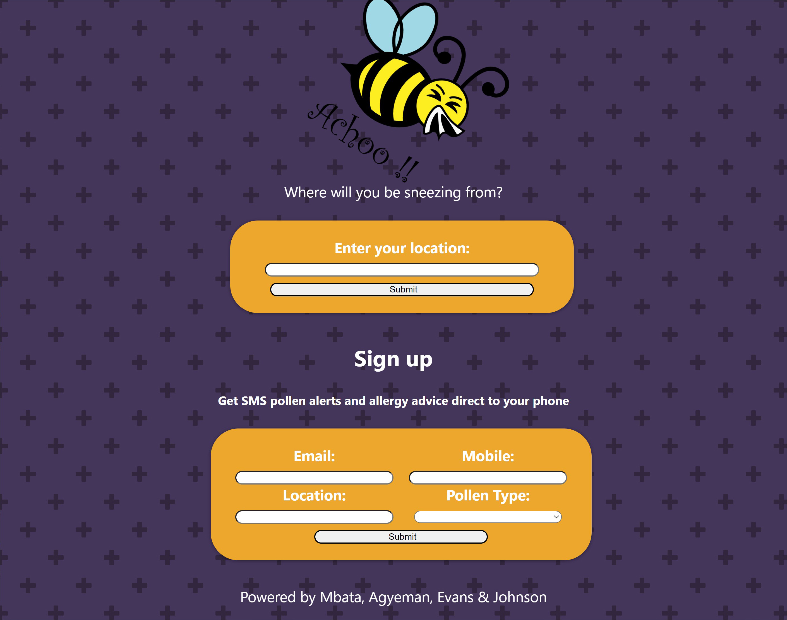
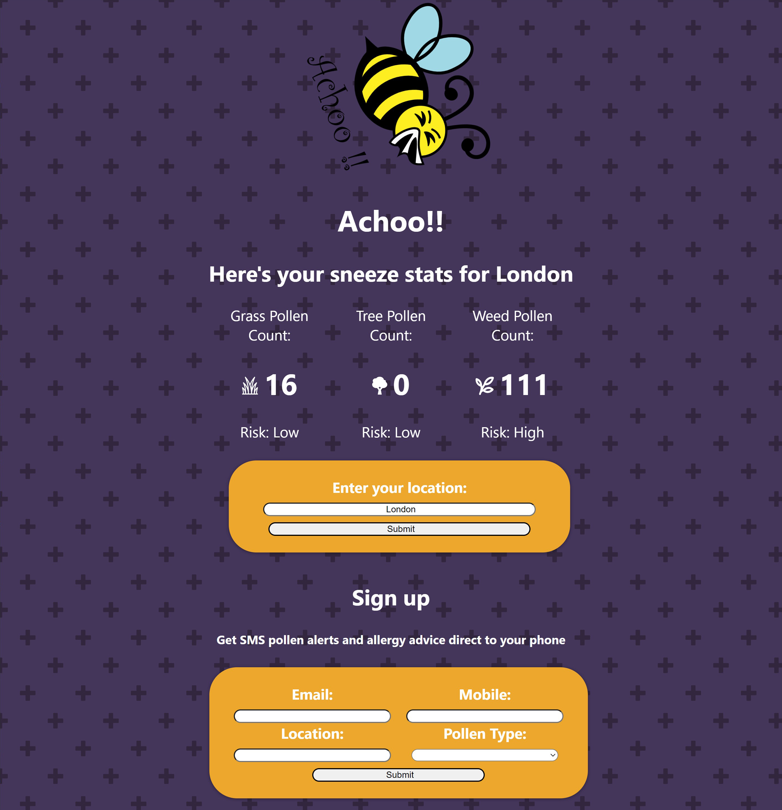
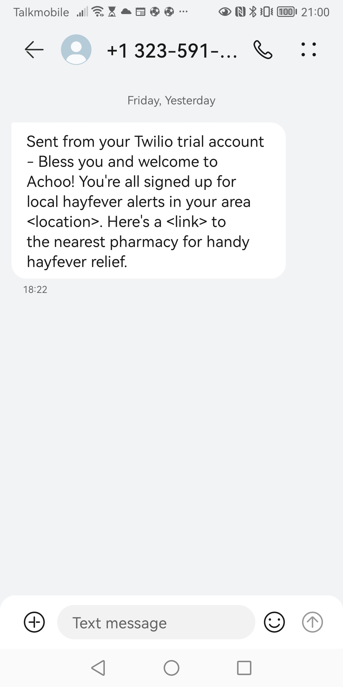

# ACHOO!-hayfever-app (REACT-FRONT-END)

Welcome to Achoo!! - It's the bees sneeze!

A location based app that notifies you with an SMS when pollen count levels reach dangerously sneezey levels in your area.

## Screenshots





# TECHNOLOGIES used

- [Express](https://expressjs.com/) web framework for Node.js.
- [React] (https://reactjs.org/) - for frontend
- [MongoDB] fot local database testing
- [MongoDB Atlas](https://www.mongodb.com/atlas/database) for AWS cloud database
- [Mongoose](https://mongoosejs.com) to model objects in MongoDB.
- [Nodemon](https://nodemon.io/) to reload the server automatically.
- [ESLint](https://eslint.org) for linting.
- [Jest](https://jestjs.io/) for testing.
- [Cypress](https://www.cypress.io/) for end-to-end testing.
- [Axios](https://github.com/axios/axios) for pollen api parsing
- [Ambee](https://www.getambee.com/) pollen and climate API data.
- [Twilio](https://www.twilio.com/) for SMS notifications.

## Available Scripts

In the project directory, you can run:

# Cypress for integration testing

- To install cypress for testing: https://docs.cypress.io/guides/getting-started/opening-the-app#Adding-npm-Scripts
- To run from CLI: Add this as a script in package.json file // "cypress:open": "cypress open" //
- To run from command line use : // npm run cypress:open //
- To test from the command line use: // npm run test:integration //

# Jest for unit testing

- To test from the command line use: // npm run test:unit //

# Unit and Integration testing together

- To test from the command line use: // npm run test:all //

# Nodemon for automatic reloading of the host server

- To add nodemon to package.json file as dependencies: // npm install --save-dev nodemon //
- Add to scripts in package.json file: // "start": "nodemon ./bin/www", //
- To run nodemon: // npm start //

## Getting Started

The application uses the ambee API (https://www.getambee.com/api-documentation). The API key has a 30-day expiry (last activated on 02/08/2022). API key may need to be updated if outside the 30 day limit from the date shown in this README.

### Installation

The application has been built on Express.js. To install clone the repo and then run the command below:

```
npm install
```

### Running the program using Atlas Cloud MongoDB Database with Twillio SMS functionality

- Run Express Server using:

```
npm start
```

- Run React Client using:

```
npm start
```

### Running the program using Local MongoDB Database

- First change DB config to local config in bin/www

- On WSL2, start database using:

```
sudo service mongodb start
```

or

```
sudo mongod --dbpath ~/data/db
```

- Run React Client using:

```
npm start
```

- Run Express Server using:

```
npm start
```

- Run React Client using:

```
npm start
```

### SCREENNSHOTS & DIAGRAMS

In 'Diagrams' folder.

### COLLABORATORS

JENNIE - https://github.com/Jenniered
DAVID - https://github.com/fridayshoes
EPHRON - https://github.com/Ephfullstack
DANIEL - https://github.com/danielotf

# LINK TO BACK-END REPO :

https://github.com/fridayshoes/achoo-hayfever-server-express
